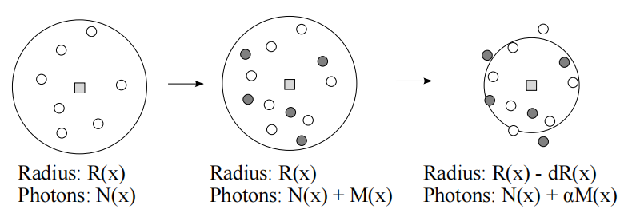

# 随机渐进式光子映射
**GAMES101 Final Project**

[演示视频链接](https://pan.baidu.com/s/1ZN11iP0CDYqgQwz0iRNw5g)

**提取码** rvma

Tested on: Windows 10, i5-4200H @ 2.80GHz

<p align="center">
  
</p>

# Overview
路径追踪渲染器在渲染 caustics 效果时效率很低。为了改善这一点，有一种称为光子映射 (photon mapping) 的技术，它在 caustics 上更有效，因为它允许路径样本在像素之间共享。

我在作业7的基础上，扩充了光子映射追踪器，使用的是KD-tree结构的光子图，并实现了渐进式光子映射的过程。

# Milestones

#### Milestone 1
  - 完成光子图的建立
  - 光子图的可视化
  - KD-tree搜索结构

#### Milestone 2
  - 实现基本的光子映射
  - 单项路径追踪+光子映射混合方案

#### Final
  - 实现渐进式光子映射追踪器
  - 实现bdpt追踪器

# Implementation

## Basic Photon Mapping
基本的光子映射分为两个阶段（pass）。
第一阶段，构建一张光子图，存储从光源发射的所有光子的通量信息。
第二阶段，从相机进行传统的路径追踪（path tracing），在追踪到漫反射表面的时候，统计附近的光子信息，并根据这些信息计算出最终的辐射率（radiance）。

### Pass 1：光子贴图（Photon Map）的构建
在实现光子贴图时，遇到的最先问题就是要按光子发射的数量来进行存储（可变光子贴图大小），还是直接固定光子贴图大小，然后不断的发射光子，直到达到光子贴图的大小为止。经过各种尝试，这里选择了固定光子贴图大小。

#### 全局光子贴图实例
size=20000          | size=200000
:-------------------------:|:-------------------------:|
| 

#### Code
* `src/tracer/Photonmap.h`: 光子贴图的具体实现
  * `buildKdTree` 对存储的光子贴图创建KD-tree结构, 具体在 `balance` 中。
  * `radiance_estimate` 对给定的碰撞点周围的光子进行统计，并返回该点最后的 radiance。
  * `render_photons` 在窗口模式下，绘制所存储的光子。
* `src/tracer/neighbor.h`: 光子搜索的具体实现
  * `Photon` 实际光子的存储结构。
  * `KdTree` KD-tree的存储结构。
  * `neighbor_search` 最近光子搜索的过程。

### Pass 2：基本全局光子映射（Photon Mapping）
现在我们有一整张完整的光子贴图了，这个贴图记载了整个场景的所有光子数据，接下来就要进行光线追踪，并在它第一次碰漫反射表面时进行radiance估计。

#### Results
size=20000，N=100 | size=200000，N=100 | size=2000000，N=1000
:-----------------:|:------------------:|:------------------:|
| | 

全局光子映射是几乎不经任何修饰的最原始的光子映射方案，所以它也保留了相当明显的光子映射特征：由于样本自身的随机性+密度估计本身的插值效应，因此在样本数量较少的情况下，光子映射生成的不是传统的高频噪音图像，而是明显的块状斑点。
而且一旦密度估计范围（N值）相对光子总数过高，墙角部分的会出现比较明显的渗色现象（color bleeding），后面会对这些进行改进。

## 单项路径追踪+光子映射混合方案
将渲染积分分解成多段，对每部分都根据自身的特性进行针对性的处理。其中部分使用路径追踪，部分使用光子映射。
<center>
	
</center>
按照上面的拆分，逐个考虑每一项的计算策略：
-  直接照明项和高亮反射表面(glossy)，使用**直接照明+路径追踪**。
-  漫反射表面+焦散照明，使用**焦散光子图**。
-  漫反射表面+间接漫反射照明，使用**全局光子图**。

### 新增焦散光子图(Caustic Photon Map)
原先全局光子图在每发生漫反射时都记录一次，直到停止迭代。而如果是焦散光子图，则只记录第一次漫反射时，并且光子必须经过至少一次Specular反射或Glossy反射

#### 焦散光子贴图实例
size=5000          | size=50000
:----------------------:|:------------------------:|
| 

### Results
global=20000，N=100; caustic=5000, N=50 | global=200000，N=100; caustic=50000, N=50
:--------------------:|:---------------------:|
| 

由于重新引入了直接照明的关系，我们又看到了路径追踪中经典的高频噪音，但漫反射部分的噪音得到了更有效的优化。

### Code
* `src/tracer/TkSppmTracer.h`: 光子映射过程的实现
  * `tracePhoton` Pass 1 追踪发射的光子，记录到全局光子贴图。
  * `traceCausticPhoton` Pass 1 追踪发射的光子，记录到焦散光子贴图。
  * `traceTile` Pass 2 进行光线追踪，估计碰撞表面的radiance。

## 渐进式光子映射(SPPM)
SPPM调整了光子映射的计算模型，使其可以近似完全收敛。

### PPM中的半径缩减
定义观察点 $x$ 有一个半径 $R(x)$ ，目标是在该半径范围内增加累计光子数量 $N(x)$ ，而减小半径。**密度函数**定义为：$$d(x)=\frac{N(x)}{\pi R^{2}(x)}$$假设在经过一次密度估计之后，已经累计了 $R_1(x)$ 个光子，维持半径不变，再重新生成一张新的光子图，得到新增的光子个数 $M_1(x)$，进而形成两张光子图合并后的新密度，我们用 $d_2(x)$ 表示：$$d_2(x)=\frac{N_1(x) + M_1(x)}{\pi R_1(x)^{2}}\quad(3)$$假设密度在缩减过程中是始终不变的（实际上也确实不变，只不过初期离散样本较少的时候会有波动误差，但随着样本增多，密度就会趋于稳定），就可以计算出半径缩减后的下一轮光子的个数 $N_2(x)$ 与密度 $d_2(x)$ 的关系：$$N_2(x)=\pi R_2(x)^{2}d_2(x)=\pi(R_1(x)-\Delta R_1(x))^{2}d_2(x)\quad(4)$$其中 $\Delta R_1(x)$ 代表第一次迭代过渡到第二次时，半径的缩减量。

而下一轮光子个数 $N_2(x)$ 的数量，取决于上一轮光子 $N_1(x)$ 及新增光子 $M_1(x)$ 。我们无法对 $N_1(x)$ 进行缩放，因为这部分光子属于前继迭代的统计结果，在本轮迭代属于无法变更的已知条件。于是我们只能对本轮新增的部分 $M_1(x)$ 动刀子。这就需要设置一个**缩减系数** $\alpha$ 来控制每次迭代之后的要**保留的光子比例**(因为半径减少而导致的光子失效)，因此新的累积光子数又能表示为：$$N_2(x)=N_1(x)+\alpha M_1(x)\quad(5)$$
<center>
  
</center>
最后结合公式(3)、(4)、(5)可得出下一轮的收敛半径 $R_2(x)$:
<center>
  
</center>

### Flux Correction 和 Radiance Evaluation
对于观察点 $x$ 接收到的 $M(x)$ 个光子的能量，需要考虑上一节计算得到的半径衰减来修正能量(半径越大能量衰减越大)。对于 $N(x)$ 个光子，最终的通量为：
<center>
  
</center>
最后一步计算观察点辐射度，已知当前观察点 $x$ 的**光子半径** $R(x)$ 、**通量** $\tau(x, \omega)$ 和**总发射光子数** $N_{emitted}$ ，则辐射度表达式为：
<center>
  
</center>
### SPPM实现
首先从PPM开始，渲染时为每个像素一次性生成若干射线样本，并与场景中第一个遇到的漫反射面相交形成命中点。然后不断围绕这些命中点进行迭代，随着半径越缩越小逐渐收敛到接近无噪的结果。
<center>
  
</center>
而SPPM在每个渲染阶段，先进行一次射线追踪，再对每次射线追踪生成一小批命中点，并围绕这些命中点进行收敛。
<center>
  
</center>
先定义用于存储命中点对应像素信息的struct
```
struct SPPMPixel
{
	Spectrum Ld;
	Spectrum causticFlux, globalFlux;
	Real causticPhotons, globalPhotons;
	Real causticRadius2, globalRadius2;
};
```
然后每次迭代使用前面的单项路径追踪+光子映射混合方案，最后根据上述公式完成radiance估计。
```
iteration:
  Generate: 
  {
    //生成全局光子图
    //生成caustic光子图
    //建立KD-tree
    //切换成Rendering
  }
  Rendering:
  {
    //每个像素随机发射一条光线
    //找到第一个漫反射表面
    //进行密度估计
    //计算新的光子数，半径和通量
    //更新SPPMPixel
    //进行下一次迭代
  }
```

### 渲染结果
iteration 16 | iteration 64
:--------------------:|:---------------------:|
| 

单次迭代的设置：
- 直接照明：每像素 1 条射线
- 全局光子图：单张 200000 光子，密度估计：N=100
- 焦散光子图：单张 50000 光子，密度估计：N=50

## BDPT
实现了基本的BDPT追踪器，下面是经典场景渲染结果
spp 4 | spp 16
:--------------------:|:---------------------:|
| 

# References
- [Progressive Photon Mapping](http://graphics.ucsd.edu/~henrik/papers/progressive_photon_mapping/progressive_photon_mapping.pdf)
- [Stochastic Progressive Photon Mapping](http://graphics.ucsd.edu/~henrik/papers/sppm/stochastic_progressive_photon_mapping.pdf)
- [cs348b-course8](https://graphics.stanford.edu/courses/cs348b-00/course8.pdf)
- Realistic Image Synthesis Using Photon Mapping by Henrik Wann Jensen
- [Robust Monte Carlo Methods for Light Transport Simulation](https://graphics.stanford.edu/papers/veach_thesis/)
- [Physically Based Rendering](https://www.pbrt.org/)